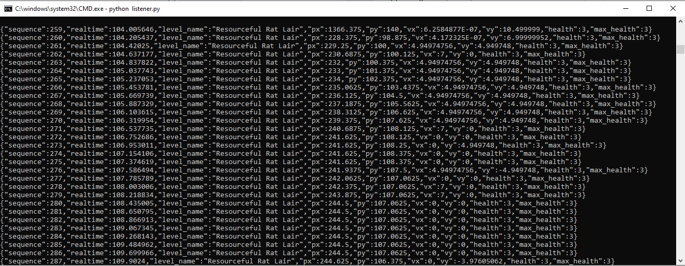

# Enter the Gungeon ML Tracker (Project Plan)

## Summary

This project is me trying to capture **Enter the Gungeon** game state through **BepInEx** and turning those "observations" into data for training a **PyTorch** model. The long-term goal is to train "player" a model to reason about the game and eventually pilot a character through runs without input.

---

## Objectives

1. **Instrument the Game:** Use a BepInEx 5.4.x plugin (built with .NET 9.0) to access the live Unity runtime and extract player, enemy, projectile, and room metadata.
2. **Stream Observations:** Serialize each frame’s state to JSON and push it to a localhost API for storage and downstream processing.
3. **Curate Datasets:** Organize captured logs into clean, versioned datasets suitable for both supervised and reinforcement learning experiments.
4. **Model Training:** Prototype training pipelines in PyTorch that learn from the captured data (predict next actions, evaluate reward functions, etc.).
5. **Closed-Loop Control (Future):** Investigate how to drive in-game inputs with a trained model, creating a full “model plays the game” loop.

The goal is to push data with descriptions into a localhost to be able to read for training data 
for a pytorch model
---

## Architecture Sketch (Draft)

```
Enter the Gungeon (Unity)
        │
        ▼
BepInEx Plugin (.NET 9.0)
        │  (Hooks into Unity API)
        ▼
Game State Extractor
        │  (Serialize → JSON)
        ▼
Localhost Ingestion Service (Python FastAPI/Flask TBD)
        │
        ├─► Disk Logging (JSON/CSV/Parquet)
        └─► Live Monitoring / Debug Dashboards
        ▼
Data Processing & Feature Engineering
        │
        ▼
PyTorch Training Pipelines
        │
        ▼
Experimental Agents / Evaluation Harness
```

## Repository Layout (Planned)

| Path/Module                | Purpose                                                                 |
|----------------------------|-------------------------------------------------------------------------|
| `GungeonRLTracker/`        | Unity/BepInEx plugin source (C# / .NET 9.0).                            |
| `scripts/`                 | Tooling for log parsing, dataset assembly, schema validation.           |
| `notebooks/`               | Exploratory, prototyping reward functions, sanity checks.               |
| `training/`                | PyTorch training, models, utilities.                                    |
| `docs/`                    | Additional notes.                                                       |

*(note for later)*

---

## Data Schema (First Draft)

| Field                                                      | Description                                                                              |
|------------------------------------------------------------|------------------------------------------------------------------------------------------|
| - [x] `sequence`                                           | Incrementing identifier per snapshot.                                                    |
| - [x] `realtime`                                           | Seconds since level load (`Time.realtimeSinceStartup`).                                  |
| - [x] `level_name`                                         | Current floor name (e.g., “Base Camp”).                                                  |
| - [x] `player.position`                                    | `[x, y]` world coordinates (center).                                                     |
| - [x] `player.velocity`                                    | `[x, y]` velocity vector.                                                                |
| - [x] `player.looking_angle`                               | Float degrees in range `[0, 360)` derived from `CurrentGun.CurrentAngle`                 |
| - [x] `player.health`, `player.max_health`, `player.armor` | Vital stats from `HealthHaver`.                                                          |
| - [x] `player.blanks`, `player.money`, `player.keys`       | Consumables inventory.  Integer count (≥ 0). Value is `-1` if unavailable.               |
| - [] `player.current_gun_id`, `player.current_gun_ammo`    | Active weapon identifier and ammo count.                                                 |
| - [] `player.passive_item_ids`                             | List of passive item pickup IDs.                                                         |
| - [] `enemies[]`                                           | Per enemy: position, health, boss flag, distance to player.                              |
| - [] `projectiles[]`                                       | Per projectile: position, direction, speed, `is_enemy` flag.                             |
| - [] `room.*`                                              | Current room metadata: grid coords, dimensions, remaining enemies, boss flag.            |
| - [] `reward`                                              | Scalar reward (damage dealt, damage taken, room cleared, etc.).                          |
| - [] `meta.run_id`                                         | Unique identifier per run/session (helps join multi-file logs).                          |
| - [] `meta.version`                                        | Schema version for backward compatibility.                                               |


---

## Milestones & Tasks

### Phase 1 – BepInEx Setup
- [x] Install BepInEx 5.4.x into Enter the Gungeon directory.
- [x] Scaffold a .NET 9.0 class library project targeting BepInEx plugin conventions.
- [x] Verify plugin loads (simple console/log output).

### Phase 2 – State Extraction
- [x] Locate Unity components for player stats, enemies, projectiles, and rooms.
- [ ] Implement safe null-checks and error handling for runtime state access.
- [x] Serialize a minimal JSON payload every frame (or on fixed timestep).
- [ ] Add configuration toggles (e.g., sampling rate, log level).

### Phase 3 – Localhost Service
- [x] Prototype listerner for localhost
- [ ] Implement logging with files and timestamped directories.
- [ ] Add basic schema validation to reject malformed data (e.g. Loading and Breach Areas).
- [ ] Document service ports, environment variables, and launch scripts.

### Phase 4 – Dataset Engineering
- [ ] Create scripts to merge raw logs, deduplicate sequences, and tag with run metadata.
- [ ] Draft reward shaping heuristics (damage taken, enemies cleared, etc.).
- [ ] Version datasets and keep changelog entries for each iteration.

### Phase 5 – Training Experiments
- [ ] Build a PyTorch Dataset/Dataloader that streams processed logs.
- [ ] Train a baseline supervised model (predict next action or movement direction).
- [ ] Evaluate metrics: accuracy, survival time proxy, room-clear success.
- [ ] Log experiments (tensorboard or lightweight CSV summaries).

### Phase 6 – Control Loop Prototype (Future)
- [ ] Design an input bridge (e.g., virtual controller) to send actions back to the game.
- [ ] Test inference latency and frame-sync requirements.

---

## Tooling & Environment Notes

- **Language/Runtime:** C# with .NET 9.0 for plugins; Python 3.11+ for services and ML.
- **Dependencies:** BepInEx 5.4.x, Unity assemblies from Enter the Gungeon installation, PyTorch, FastAPI/Flask, pandas, numpy, msgpack/protobuf (future).
- **Logging:** C# and (structlog/loguru) Python for logs.
- **Configuration Management:** `.env` files for service ports, output directories, sampling intervals.

---

## Open Questions & Future Ideas

- ''
  
---
